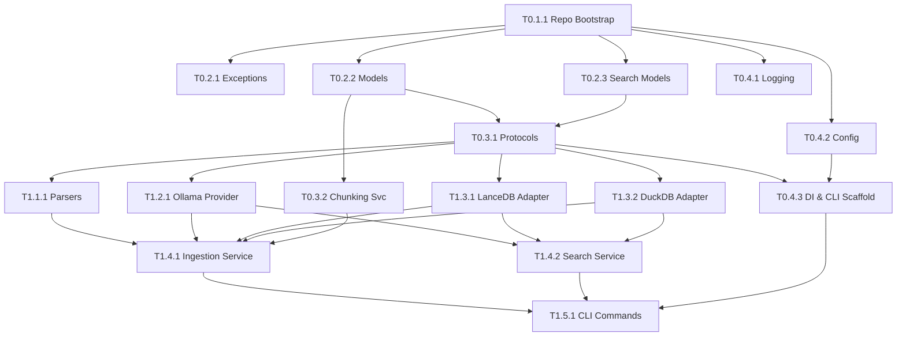

# Knowledge Engine — Engineering Backlog (v0.1.0)

**Status:** APPROVED
**Blueprint Version:** 1.0

This document is the canonical engineering work queue for implementing v0.1.0 of the Knowledge Engine. It transforms the Project Blueprint v1.0 into actionable, independently verifiable tasks.

---

## 1. Milestone Overview

| Milestone | Name | Focus | Status |
|-----------|------|-------|--------|
| **M0** | Foundation | Scaffolding, Domain, Config, Logging, Interfaces | PENDING |
| **M1** | Parse + Embed + Search | Parsers, Ollama, LanceDB, DuckDB, Application Services | PENDING |
| **M2** | Watch Mode + Resilience | Watchdog, Incremental Updates, Error Recovery | PENDING |
| **M3** | Release v0.1.0 | CI/CD, Docs, Packaging, Evals | PENDING |

---

## 2. Epic Breakdown

### M0: Foundation
*   **E0.1:** Project Scaffolding & Tooling
*   **E0.2:** Core Domain Models & Exceptions
*   **E0.3:** Domain Ports & Services
*   **E0.4:** Cross-Cutting Concerns (Logging, Config, DI)

### M1: Parse + Embed + Search
*   **E1.1:** Parsing Engine
*   **E1.2:** AI Provider Integration
*   **E1.3:** Storage Adapters
*   **E1.4:** Application Orchestration
*   **E1.5:** CLI Core Commands

### M2: Watch Mode + Resilience
*   **E2.1:** File Watcher & Incremental Indexing
*   **E2.2:** Resiliency & State Management
*   **E2.3:** End-to-End Testing

### M3: Release v0.1.0
*   **E3.1:** Documentation & Packaging
*   **E3.2:** Search Evaluation Suite

---

## 3. Complete Engineering Backlog

### Milestone 0: Foundation

#### Epic E0.1: Project Scaffolding & Tooling

**Task T0.1.1: Repository Bootstrap & Tooling Configuration**
*   **Metadata:** Priority: P0 | Complexity: S | Duration: 1 day | Deps: None | Role: Testing Engineer
*   **Description:** Initialize the Python package structure using `uv`. Configure `pyproject.toml` with dependencies, `ruff` for linting/formatting, `mypy` for strict type checking, and `pytest` for testing.
*   **Files:** `pyproject.toml`, `Makefile`, `tests/conftest.py`, `src/lke/__init__.py`, `src/lke/py.typed`
*   **Deliverables:** A working `uv` project where `make test`, `make lint`, and `make typecheck` execute successfully with zero errors.
*   **Acceptance Criteria:**
    *   `uv sync` installs all dependencies.
    *   `mypy --strict` passes.
    *   `ruff check` and `ruff format` pass.
*   **Testing:** Basic dummy test in `tests/unit/test_basic.py` passes.
*   **Docs:** Update `README.md` with dev setup instructions.
*   **DoD:** Meets project DoD.

#### Epic E0.2: Core Domain Models & Exceptions

**Task T0.2.1: Exception Hierarchy & Domain Events**
*   **Metadata:** Priority: P0 | Complexity: XS | Duration: 0.5 days | Deps: T0.1.1 | Role: Architect
*   **Description:** Define the base exception hierarchy for the application to avoid bare exceptions. Define the base `DomainEvent` class and core events.
*   **Files:** `src/lke/domain/exceptions.py`, `src/lke/domain/events/base.py`
*   **Deliverables:** Exception classes (`LKEError`, `DomainError`, `InfrastructureError`, `ConfigurationError`). Event dataclasses (`DomainEvent`, `FileChanged`, `DocumentIndexed`, `DocumentDeleted`, `IndexingFailed`).
*   **Acceptance Criteria:** Exceptions can be instantiated. Events are frozen dataclasses.
*   **Testing:** Unit tests verifying event instantiation and immutability.

**Task T0.2.2: Document & Knowledge Domain Models**
*   **Metadata:** Priority: P0 | Complexity: M | Duration: 1 day | Deps: T0.1.1 | Role: Engineer
*   **Description:** Implement the core DDD models: `Document`, `ParsedContent`, `DocumentChunk`, `DataSource`.
*   **Files:** `src/lke/domain/models/document.py`, `src/lke/domain/models/source.py`
*   **Deliverables:** Pydantic or frozen dataclass models with strict typing and validation. Enums for `SourceType`, `DocumentStatus`, `ContentType`, `LinkType`.
*   **Acceptance Criteria:** Models enforce type safety. `Document` does not contain chunks (lightweight reference). `ParsedContent` contains chunks and metadata.
*   **Testing:** Unit tests for model validation and initialization logic.

**Task T0.2.3: Embedding & Search Domain Models**
*   **Metadata:** Priority: P0 | Complexity: S | Duration: 0.5 days | Deps: T0.1.1 | Role: Engineer
*   **Description:** Implement `EmbeddingVector`, `VectorSearchHit`, `SearchQuery`, `SearchResult`, `ProviderCapabilities`.
*   **Files:** `src/lke/domain/models/embedding.py`, `src/lke/domain/models/search.py`
*   **Deliverables:** Value objects representing embeddings and search results.
*   **Acceptance Criteria:** Models enforce type safety. `SearchResult` is composed correctly.
*   **Testing:** Unit tests for model validation.

#### Epic E0.3: Domain Ports & Services

**Task T0.3.1: Protocol Interfaces (Ports)**
*   **Metadata:** Priority: P0 | Complexity: S | Duration: 0.5 days | Deps: T0.2.2, T0.2.3 | Role: Architect
*   **Description:** Define the `Protocol` interfaces for repositories and providers.
*   **Files:** `src/lke/domain/ports/document_repository.py`, `src/lke/domain/ports/vector_repository.py`, `src/lke/domain/ports/ai_provider.py`, `src/lke/domain/ports/parser.py`, `src/lke/domain/ports/graph_repository.py`
*   **Deliverables:** Pure Python `typing.Protocol` classes with complete docstrings. No implementations.
*   **Acceptance Criteria:** `mypy` successfully validates types against the domain models. No external dependencies (e.g., no `lancedb` imports).

**Task T0.3.2: Domain Services (Chunking & Scoring)**
*   **Metadata:** Priority: P1 | Complexity: M | Duration: 1 day | Deps: T0.2.2 | Role: Engineer
*   **Description:** Implement `ChunkingService` (splits `ParsedContent` into `DocumentChunk`s) and `RelevanceScorer`.
*   **Files:** `src/lke/domain/services/chunking.py`, `src/lke/domain/services/relevance.py`
*   **Deliverables:** `ChunkingService` with `chunk()` method using token estimation and context overlap.
*   **Acceptance Criteria:** Correctly chunks text without splitting words. Maintains overlap. Respects headings.
*   **Testing:** Unit tests with various text lengths and edge cases (empty text, very long words).

#### Epic E0.4: Cross-Cutting Concerns

**Task T0.4.1: Logging & Observability**
*   **Metadata:** Priority: P0 | Complexity: S | Duration: 0.5 days | Deps: T0.1.1 | Role: Engineer
*   **Description:** Configure `loguru` with structured JSON output for CI and colored output for dev. Implement the `@timed` decorator.
*   **Files:** `src/lke/infrastructure/logging/setup.py`, `src/lke/infrastructure/logging/decorators.py`
*   **Deliverables:** `setup_logging(level)` function. `@timed(operation="...")` decorator.
*   **Acceptance Criteria:** Logs contain `module`, `operation`, and `correlation_id` fields.

**Task T0.4.2: Configuration Loader**
*   **Metadata:** Priority: P0 | Complexity: M | Duration: 1 day | Deps: T0.1.1 | Role: Engineer
*   **Description:** Implement the TOML config loader with 5-level precedence (Defaults → User → Project → Env → CLI).
*   **Files:** `src/lke/infrastructure/config/loader.py`, `src/lke/defaults/config.toml`
*   **Deliverables:** `AppConfig` Pydantic model (frozen). Function to load and merge config.
*   **Acceptance Criteria:** `LKE__SEARCH__TOP_K` env var overrides TOML. Validates successfully.
*   **Testing:** Unit tests covering all precedence layers and validation errors.

**Task T0.4.3: Dependency Injection Container & CLI Scaffold**
*   **Metadata:** Priority: P0 | Complexity: S | Duration: 0.5 days | Deps: T0.3.1, T0.4.2 | Role: Engineer
*   **Description:** Create a basic DI container to hold port implementations. Initialize the Typer CLI app.
*   **Files:** `src/lke/cli/app.py`, `src/lke/cli/container.py`
*   **Deliverables:** `typer.Typer()` app with empty `init`, `index`, `search` commands. Basic DI registry.
*   **Acceptance Criteria:** `lke --help` works. Commands do nothing but execute successfully.

---

### Milestone 1: Parse + Embed + Search

#### Epic E1.1: Parsing Engine

**Task T1.1.1: Markdown & Obsidian Parsers**
*   **Metadata:** Priority: P0 | Complexity: L | Duration: 2 days | Deps: T0.3.1 | Role: Engineer
*   **Description:** Implement the `Parser` protocol for standard Markdown and Obsidian (wikilinks, callouts).
*   **Files:** `src/lke/infrastructure/parsing/markdown_parser.py`, `src/lke/infrastructure/parsing/obsidian_parser.py`
*   **Deliverables:** Parsers that extract text, frontmatter, sections, and links into `ParsedContent`.
*   **Acceptance Criteria:** Wikilinks (`[[target]]`) are extracted. Frontmatter is parsed as a dict.
*   **Testing:** Extensive unit tests against edge cases (malformed frontmatter, broken links, deeply nested headings).

#### Epic E1.2: AI Provider Integration

**Task T1.2.1: Ollama Provider & Capability Detection**
*   **Metadata:** Priority: P0 | Complexity: M | Duration: 2 days | Deps: T0.3.1 | Role: Engineer
*   **Description:** Implement `AIProvider` for Ollama.
*   **Files:** `src/lke/infrastructure/ai/ollama_provider.py`
*   **Deliverables:** `OllamaProvider` implementing `embed()`, `generate()`, and `capabilities()`.
*   **Acceptance Criteria:** Batched embeddings work. Connection failures raise `TransientError`. Startup fetches capabilities.
*   **Testing:** Integration tests against a local Ollama instance (skipped in standard unit tests).

#### Epic E1.3: Storage Adapters

**Task T1.3.1: LanceDB Vector Repository**
*   **Metadata:** Priority: P0 | Complexity: M | Duration: 2 days | Deps: T0.3.1 | Role: Engineer
*   **Description:** Implement `VectorRepository` using LanceDB. Schema must include vector, doc_id, chunk_index, content.
*   **Files:** `src/lke/infrastructure/persistence/lancedb_repo.py`
*   **Deliverables:** Implementation of `store()`, `search()`, `delete_by_document()`.
*   **Acceptance Criteria:** Vectors can be stored and ANN searched. `delete_before_insert` logic works.
*   **Testing:** Integration tests creating a temporary LanceDB on disk.

**Task T1.3.2: DuckDB Document Repository**
*   **Metadata:** Priority: P0 | Complexity: M | Duration: 2 days | Deps: T0.3.1 | Role: Engineer
*   **Description:** Implement `DocumentRepository` using DuckDB for metadata and state tracking.
*   **Files:** `src/lke/infrastructure/persistence/duckdb_repo.py`
*   **Deliverables:** Implementation of CRUD, status tracking, pagination.
*   **Acceptance Criteria:** Schema created automatically. UPSERT logic works. Status updates persist.
*   **Testing:** Integration tests creating a temporary DuckDB on disk.

#### Epic E1.4: Application Orchestration

**Task T1.4.1: Ingestion Service (The Pipeline)**
*   **Metadata:** Priority: P0 | Complexity: L | Duration: 3 days | Deps: T1.1.1, T1.2.1, T1.3.1, T1.3.2 | Role: Engineer
*   **Description:** Coordinate `Parser` → `ChunkingService` → `AIProvider` → `VectorRepo` & `DocumentRepo`. Implement content hashing skip and error categorizations.
*   **Files:** `src/lke/application/services/ingestion_service.py`
*   **Deliverables:** `index_document(path)` and `index_vault(path)` methods.
*   **Acceptance Criteria:** Skips unchanged files. Handles partial errors gracefully. Exponential backoff on Ollama timeouts.
*   **Testing:** Unit tests using Mocks for infrastructure.

**Task T1.4.2: Search Service**
*   **Metadata:** Priority: P0 | Complexity: M | Duration: 1 day | Deps: T1.2.1, T1.3.1, T1.3.2 | Role: Engineer
*   **Description:** Coordinate `AIProvider` (embed query) → `VectorRepo` → `DocumentRepo` → `RelevanceScorer`.
*   **Files:** `src/lke/application/services/search_service.py`
*   **Deliverables:** `search(query, top_k)` method returning `list[SearchResult]`.
*   **Acceptance Criteria:** Retrieves full documents for vector hits. Applies scoring logic.

#### Epic E1.5: CLI Core Commands

**Task T1.5.1: Init, Index, and Search CLI Commands**
*   **Metadata:** Priority: P0 | Complexity: M | Duration: 1 day | Deps: T1.4.1, T1.4.2, T0.4.3 | Role: Engineer
*   **Description:** Implement Typer commands with Rich progress bars and formatted output.
*   **Files:** `src/lke/cli/commands/init.py`, `index.py`, `search.py`
*   **Deliverables:** Working CLI commands. `lke init` validates Ollama. `lke index` shows progress bar. `lke search` shows formatted hits.
*   **Acceptance Criteria:** Output is beautiful, clear, and handles errors without traceback vomit.

---

## 4. Dependency Graph

---

## 5. Parallel Work Opportunities

Once **T0.3.1 (Protocols)** is complete, the infrastructure adapters can be built entirely in parallel by different engineers:
*   **Track A:** `T1.1.1` (Parsers)
*   **Track B:** `T1.2.1` (Ollama)
*   **Track C:** `T1.3.1` (LanceDB)
*   **Track D:** `T1.3.2` (DuckDB)

Because they all code against strict interfaces (DIP), they do not block each other.

---

## 6. Critical Path Analysis

The critical path for M1 is:
`T0.1.1 (Repo Bootstrap)` → `T0.2.2 (Domain Models)` → `T0.3.1 (Protocol Interfaces)` → `T1.3.1 (LanceDB Adapter)` → `T1.4.1 (Ingestion Service)` → `T1.5.1 (CLI Core Commands)`.

**Why:** The `IngestionService` cannot be fully unit tested without the `VectorRepository` protocol, and it cannot be integration tested until the LanceDB adapter exists. The CLI cannot be built until the `IngestionService` provides the application entry point.

---

## 7. Risk Assessment

| Risk | Type | Impact | Mitigation |
|------|------|--------|------------|
| Ollama Provider Integration Flakiness | Technical | Delay in M1 | Use Mock `AIProvider` for all application service tests. Isolate Ollama flakiness to integration tests only. |
| DuckDB / LanceDB Dependency Conflicts | Integration | High (M1 blocked) | Pin versions immediately in `uv.lock`. Test Python 3.13 compatibility first. |
| Scope Creep on Parser | Schedule | Medium | Strict TDD against a known set of Obsidian fixtures. Ignore advanced Obsidian plugins (Dataview) for MVP. |
| Memory usage spikes during large ingest | Technical | Medium | Implement fixed size chunking limits and backpressure if queue builds up. |

---

## 8. Recommended Implementation Order

1. **Sprint 1 (M0):** Execute T0.1.1 through T0.4.3. The goal is a solid domain and strict DI container.
2. **Sprint 2 (M1 Infra):** Execute T1.1.1, T1.2.1, T1.3.1, T1.3.2 in parallel.
3. **Sprint 3 (M1 App & CLI):** Execute T1.4.1, T1.4.2, T1.5.1. Prove end-to-end functionality.
4. **Sprint 4 (M2/M3):** Stabilize with watch mode, evals, and docs.
